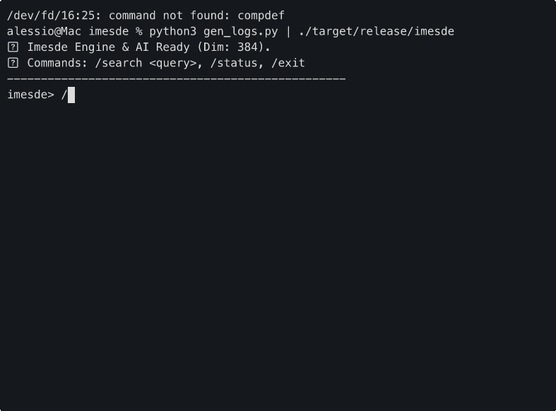

# ⚡️ imesde



> **"Data that flows, context that lives in RAM, zero-disk dependency."**

Welcome to **imesde**, the **In-Memory Streaming Data Engine**. We are defining a new category in the data landscape: the **IMESD**.

---

## 🎯 Why imesde?

Traditional vector databases are built for persistence and long-term storage. imesde is built for **speed and ephemerality**:

- **Zero-Disk Dependency**: Pure RAM operation. Old data flows out as new data flows in. No GC, no fragmentation.
- **Lock-Free Architecture**: High-throughput ingestion and search using atomic operations and sharded buffers.
- **Local-First Privacy**: In-process vectorization (ONNX) and storage. Data never leaves your machine.
- **Unix Philosophy**: Designed to be pipe-friendly. `tail -f logs | imesde`.

## 🏎 Performance

- **Sub-millisecond Latency**: Parallelized exhaustive search via **Rayon**.
- **SIMD Optimized**: Vectorized math kernels for maximum CPU throughput.
- **Sharded Buffer**: 16-shard circular architecture to minimize contention.
- **Zero-Allocation**: In-place sorting and result collection.

## 🛠 Technical DNA

- **Language**: Rust
- **Engine**: Sharded Lock-Free Circular Buffer
- **Inference**: In-process ONNX Runtime
- **Target**: 10,000+ ingestions/sec on standard hardware

---

## 🚀 Quick Start
```bash
cargo run --release
```
*Note: Requires `model.onnx` and `tokenizer.json` in the `model/` directory.*

---
*MIT Licensed. Built for the speed of thought.*